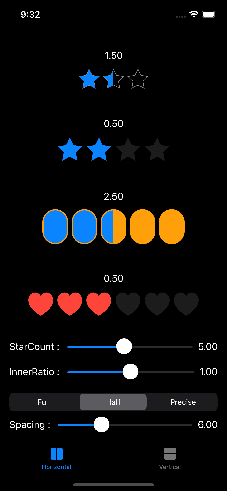
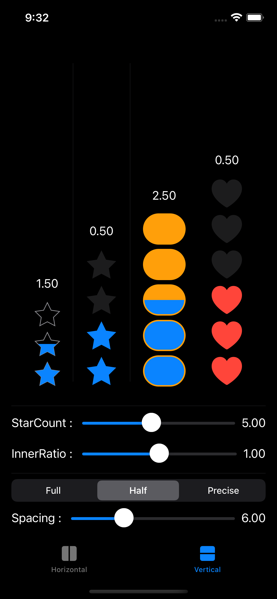

# **AxisRatingBar for SwiftUI**
This library is a UI control for iOS and macOS developed with SwiftUI. You can display ratings along the horizontal/vertical axis and receive ratings from users. You can use any view that conforms to the `View` protocol, not just the star shape.

[](https://developer.apple.com/macOS)
[](https://developer.apple.com/iOS)
[](https://developer.apple.com/macOS)
[](https://www.instagram.com/dev.fabula)
[](https://developer.apple.com/documentation/swift_packages/package/)
[](https://opensource.org/licenses/MIT)  

## Screenshot
|Horizontal|Vertical|
|:---:|:---:|
|||

https://user-images.githubusercontent.com/1617304/154843169-283913dc-be6e-4d54-a139-610cc4d085dd.mov

## Example
[https://fabulaapp.page.link/229](https://fabulaapp.page.link/229)

## Usages
```swift
/// Initializes `ARConstant`
/// - Parameters:
///   - rating: The number of views filled is typically between 1 and 5. The view is displayed according to the fill mode setting. The default value is `5`.
///   - size: The size of the individual view. The default value is `CGSize(width: 44, height: 44)`.
///   - spacing: The spacing between the view and the view. The default value is `0`
///   - fillMode: Defines how the view is filled when the rating is not an integer number. The default value is `.half`.
///   - axisMode: Defines the horizontal/vertical orientation of the rating bar. The default value is `.horizontal`.
///   - valueMode: The mode of the filled value. The default value is `.ratio`
///   - disabled: A condition that controls whether users can interact with rating bar. The default value is 'false'
///   - animation: The animation effect of the view being filled. The default value is `.easeOut(duration: 0.16)`
///

AxisRatingBar(value: $value, constant: constant) {
    /// A view builder for background views.
    ARStar(count: 5), innerRatio: 1)
        .fill(Color.gray.opacity(0.2))
} foreground: {
    /// A view builder for foreground views.
    ARStar(count: 5, innerRatio: 1)
        .fill(Color.accentColor)
}
```
  
## Swift Package Manager
The Swift Package Manager is a tool for automating the distribution of Swift code and is integrated into the swift compiler. Once you have your Swift package set up, adding AxisRatingBar as a dependency is as easy as adding it to the dependencies value of your Package.swift.

```swift
dependencies: [
    .package(url: "https://github.com/jasudev/AxisRatingBar.git", .branch("main"))
]
```

## Contact
instagram : [@dev.fabula](https://www.instagram.com/dev.fabula)  
email : [dev.fabula@gmail.com](mailto:dev.fabula@gmail.com)

## License
AxisRatingBar is available under the MIT license. See the [LICENSE](LICENSE) file for more info.
